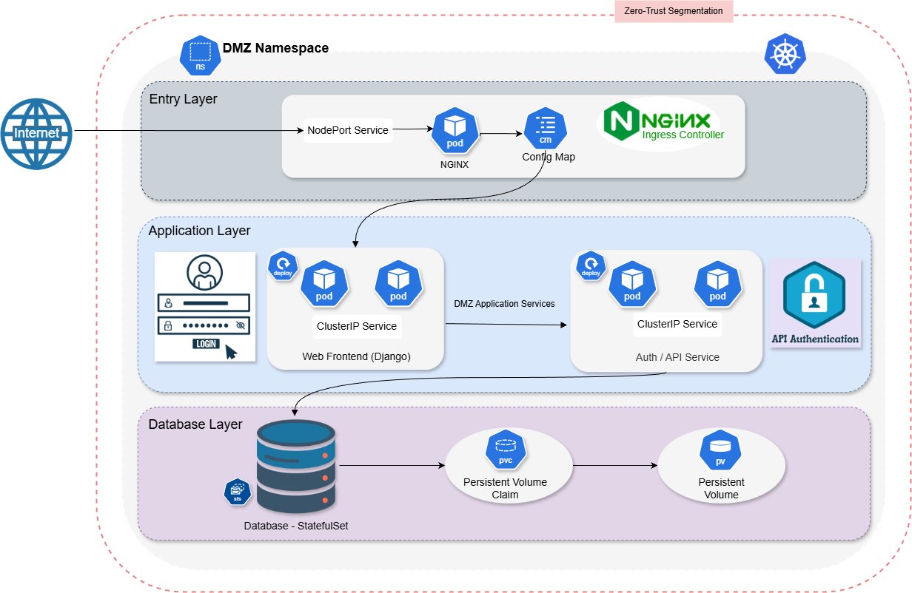

# DMZ Namespace – Kubernetes Deception Environment

## Overview

This directory contains the full implementation of the **DMZ (Demilitarized Zone) namespace** within an enterprise-style Kubernetes-based deception environment.

The DMZ represents the **public security boundary** of the infrastructure and is designed to:

- Expose controlled application services to external users  
- Enforce **zero-trust network segmentation**  
- Prevent direct access to internal namespaces  
- Simulate a **real enterprise defensive architecture** for academic and research purposes  

This component integrates with other project layers such as **HR internal services and honeypot monitoring**.

---

## Architecture Diagram

The following diagram illustrates the layered enterprise DMZ architecture, including ingress control, application isolation, and zero-trust enforcement inside Kubernetes.

---

## Architecture Summary

The DMZ namespace follows a **layered defense model** inspired by real enterprise deployments.

### 1. Entry Layer (Ingress Control)

Handles all incoming external traffic.

**Components**

- NGINX Ingress Controller (cluster entry point)  
- Host-based routing via `portal.company.local`  
- HTTP traffic termination and forwarding to internal services  

**Security Goal**

> No internal service is directly exposed to the internet.

---

### 2. Application Layer

Contains publicly reachable business logic services inside the DMZ.

**Current Implementation**

- Django web application deployed as a **Kubernetes Deployment**  
- Internal exposure using a **ClusterIP Service**  
- Reachable **only through the Ingress Controller**  

**Design Principle**

> Controlled exposure with strict namespace isolation.

---

### 3. Network Security Layer (Zero-Trust)

Communication inside the DMZ is restricted using **Kubernetes NetworkPolicies**.

| Policy | Purpose |
|--------|---------|
| `dmz-default-deny` | Blocks all ingress and egress by default |
| `dmz-allow-dns` | Allows DNS access only to `kube-system` |
| `dmz-allow-ingress` | Permits traffic only from the Ingress namespace |

**Security Model**

> Least-privilege access aligned with **zero-trust architecture**.

---

## Kubernetes Resources Structure

dmz/
├── deployments/
├── services/
├── ingress/
├── network-policies/
├── diagram/
└── README.md

Each directory represents a **distinct security responsibility** within the DMZ.

---

## Traffic Flow

External request path:

Browser → Ingress Controller → ClusterIP Service → Django Pod

**Enforcement Points**

- Internet access terminates at the **Ingress**  
- Internal services remain **non-public**  
- NetworkPolicies restrict **lateral movement**

---

## Database Note

The current Django setup uses **SQLite** for simplicity in the academic environment.

Future production-grade enhancement may include:

- PostgreSQL StatefulSet  
- Persistent Volumes  
- Secure service-to-database isolation  

This is intentionally planned as a **next-phase evolution**.

---

## Security Objectives Achieved

- Namespace isolation  
- Zero-trust network enforcement  
- Controlled ingress exposure  
- Realistic enterprise DMZ segmentation  

This enables a **defensive research platform** suitable for:

- Attack simulation  
- Monitoring integration  
- Honeypot interaction in later phases  

---

## Academic Purpose

This DMZ implementation demonstrates:

- Practical Kubernetes security architecture  
- DevSecOps-aligned infrastructure design  
- Enterprise-inspired layered defense  

It forms a **core component** of the full Kubernetes deception environment.

---

## Future Enhancements

Planned improvements:

- Web Application Firewall (WAF) integration  
- Centralized logging & SIEM forwarding  
- Production database deployment  
- Automated attack detection & alerting  

---

## Author Contribution

**DMZ Architecture & Implementation**  

Part of the collaborative project:

**Kubernetes-Based Deception Environment**
